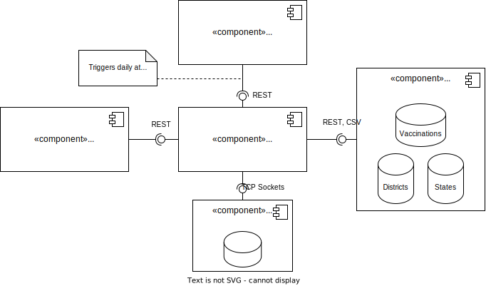

<div align="center">
  


https://kexplx.github.io/covid

</div>

# COVID-19 Metrics for Germany and Districts

- 7-Day-Incidence
- New cases
- Deaths
- Vaccinations
- 8-Day History

|                                                     Districts                                                     |                                                      History                                                      |                                                 Top 10 Districts                                                  |
| :---------------------------------------------------------------------------------------------------------------: | :---------------------------------------------------------------------------------------------------------------: | :---------------------------------------------------------------------------------------------------------------: |
|  |  |  |

## Architecture

<div align="center">



</div>

## Develop Frontend

Using **npm** in the project root:

```
cd frontend
npm install
npm start
```

_By default, the frontend will use dummy data so starting the backend isn't necessary._

## Develop Backend

1. Create a `.env` file and fill it with the API keys as implied in `.env.example`. You will need:

   - A Google Cloud Account with payment information
   - A MongoDB Account and a cluster at https://www.mongodb.com/atlas/database
   - Gmail E-Mail

2. Run `npm start` inside `/backend` to start the webserver.
